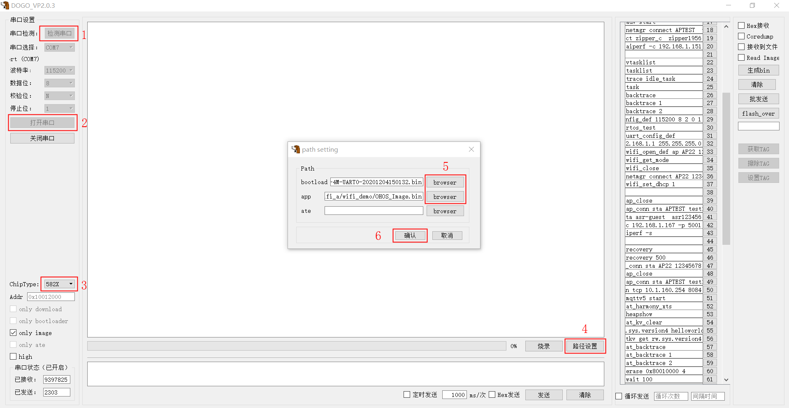

# device asrmicro
## 介绍

该仓库托管翱捷科技开发的样例代码

## 目录
```
device/soc/asrmicro
├── asr582x                                  # ASR芯片名称
│   ├── liteos_m                             # 基于liteos_m的bsp适配目录
│   │   ├── components                       # 组件服务层代码目录
│   │   └── sdk                              # sdk模块的目录
│   └── ...
├── asr5xxx                                  # ASR芯片名称
│
├── Kconfig.liteos_m.defconfig               # kconfig 默认配置宏
├── Kconfig.liteos_m.series                  # 系列soc配置宏
├── Kconfig.liteos_m.soc                     # soc kconfig配置宏
└── tools                                    # 烧录工具包目录
```
## 编译环境搭建

系统要求： Ubuntu18.04 64位系统版本。

编译环境搭建包含如下几步：

1. 安装库和工具
2. 安装repo
3. 获取源码
4. 安装python3
5. 安装hb
6. 安装arm-none-eabi-gcc
7. 编译流程
8. 烧录流程

### 安装库和工具

使用如下apt-get命令安装编译所需的库和工具：
```
sudo apt-get update && sudo apt-get install build-essential gcc g++ make zlib* libffi-dev e2fsprogs pkg-config flex bison perl bc openssl libssl-dev libelf-dev libc6-dev-amd64 binutils binutils-dev libdwarf-dev u-boot-tools mtd-utils gcc-arm-linux-gnueabi cpio device-tree-compiler git git-lfs
```
### 安装repo
1.  配置git用户信息。

    ```
    git config --global user.name "yourname"
    git config --global user.email "your-email-address"
    git config --global credential.helper store
    ```

2.  安装码云repo工具，可以执行如下命令。

    ```
    curl -s https://gitee.com/oschina/repo/raw/fork_flow/repo-py3 > /usr/local/bin/repo  #如果没有权限，可下载至其他目录，并将其配置到环境变量中
    chmod a+x /usr/local/bin/repo
    pip3 install -i https://repo.huaweicloud.com/repository/pypi/simple requests
    ```

### 获取源码

```shell
mkdir openharmony

cd openharmony

repo init -u https://gitee.com/openharmony-sig/manifest.git -m devboard_asrmicro.xml --no-repo-verify

repo sync -c

repo forall -c 'git lfs pull'
```

### 安装Python3

1. 打开Linux编译服务器终端。
2. 输入如下命令，查看python版本号：

   ```
   python3 --version
   ```

   如果低于python3.7版本，不建议直接升级，请按照如下步骤重新安装。

3. 运行如下命令安装python 3.8。

   ```
   sudo apt-get install python3.8
   ```
4. 设置python和python3软链接为python3.8。
   ```
   sudo update-alternatives --install /usr/bin/python python /usr/bin/python3.8 1
   sudo update-alternatives --install /usr/bin/python3 python3 /usr/bin/python3.8 1
   ```
5. 安装并升级Python包管理工具（pip3）。

     ```
     sudo apt-get install python3-setuptools python3-pip -y
     sudo pip3 install --upgrade pip
     ```

### 安装hb

1. 运行如下命令安装hb

   ```
   pip3 install build/lite
   ```
2. 设置环境变量

   ```
   vim ~/.bashrc
   ```

   将以下命令拷贝到.bashrc文件的最后一行，保存并退出。

   ```
   export PATH=~/.local/bin:$PATH
   ```

   执行如下命令更新环境变量。

   ```
   source ~/.bashrc
   ```
3. 执行"hb -h"，有打印以下信息即表示安装成功：

   ```
   usage: hb

   OHOS build system

   positional arguments:
     {build,set,env,clean}
       build               Build source code
       set                 OHOS build settings
       env                 Show OHOS build env
       clean               Clean output

   optional arguments:
     -h, --help            show this help message and exit
   ```

### 安装arm-none-eabi-gcc

1. 打开Linux编译服务器终端。
2. 下载[arm-none-eabi-gcc 编译工具下载](https://armkeil.blob.core.windows.net/developer//sitecore/shell/-/media/Files/downloads/gnu-rm/5_4-2016q3/gcc-arm-none-eabi-5_4-2016q3-20160926-linux,-d-,tar.bz2)


3. 解压 [gcc-arm-none-eabi-5_4-2016q3-20160926-linux.tar.bz2](https://armkeil.blob.core.windows.net/developer//sitecore/shell/-/media/Files/downloads/gnu-rm/5_4-2016q3/gcc-arm-none-eabi-5_4-2016q3-20160926-linux,-d-,tar.bz2) 安装包至 openharmony/device/soc/asrmicro/gcc/gcc-arm-none-eabi/Linux64 路径下。

   ```
   device/soc/asrmicro/gcc
   └── gcc-arm-none-eabi
      └── Linux64
         ├── bin
         ├── lib
         ├── share
         └── arm-none-eabi
   ```
   也可放置其它目录，需注意修改 openharmony/device/board/lango/dev_wifi_a/liteos_m/config.gni中的 board_toolchain_path

### 编译流程

[编译构建使用指南](https://gitee.com/openharmony/docs/blob/master/zh-cn/device-dev/subsystems/subsys-build-mini-lite.md)

```shell
hb set

asrmicro
 > wifi_demo
 > xts_demo

选择wifi_demo

hb build -f
```

### 烧录流程

1. 将 tools\DOGO_VP2.0.3.7Z 拷贝到windows 环境下解压，并双击 DOGO_VP2.0.3.exe
2. 串口连接 PC 和 demo board，点击“检测串口”按键，在串口选择一栏选择对应的端口号并点击 “打开串口”
3. 选择 “ChipType ”类型为 582X
4. 点击“路径设置”，待弹出小窗口后点击 bootload 对应的“browser”进入目录选择待烧录的
image 文件。

**图 1**  Dogo选择 


5. 点击“确认”关闭小窗口，勾选“only image”
6. 将 ASR582X 设置为 Uart boot 模式  
[朗国开发板设置为"Uart boot"模式 操作参考](https://gitee.com/openharmony-sig/device_board_lango#3-%E8%BF%9B%E5%85%A5%E7%83%A7%E5%BD%95%E6%A8%A1%E5%BC%8F-uart-boot-%E6%A8%A1%E5%BC%8F)  
7. Demo 板接通电源后，按下复位键，待出现“1F2E3D00”后点击“烧录”

**图 2**  Dogo烧录


8. 烧录完成后， 将 ASR582X 设置为 Flash boot 模式，按下复位键，DOGO 串口接收窗口中即可以看到程序正常运行  
[朗国开发板设置"Flash boot"模式 操作参考](https://gitee.com/openharmony-sig/device_board_lango#5-%E9%80%80%E5%87%BA%E7%83%A7%E5%BD%95%E6%A8%A1%E5%BC%8F-%E8%BF%9B%E5%85%A5flash-boot-%E6%A8%A1%E5%BC%8F)

# 相关仓

* [device/soc/asrmicro](https://gitee.com/openharmony-sig/device_soc_asrmicro)  
* [device/board/lango](https://gitee.com/openharmony-sig/device_board_lango)

# 常见错误与处理
### 1、Ubuntu 20.04.3 LTS 下编译报错  
   编译出现如错误：
   ```-bash: ./arm-none-eabi-gcc: No such file or directory```  
   
   解决方案：执行 ```sudo apt-get install gcc-multilib```
     

